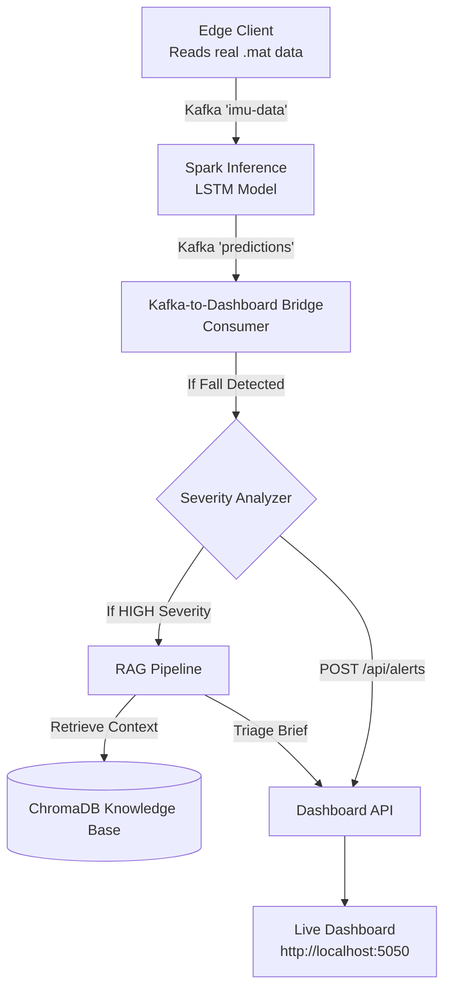

# FL-Fall-Detection: Real-Time Privacy-Preserving Fall Detection System

This repository hosts a production-ready, distributed, privacy-preserving machine learning framework designed for healthcare monitoring. It processes time-series data from wearable devices (accelerometers, gyroscopes, and heart rate sensors) to interpret physical movements and detect falls in real-time.

## What This Project Achieves

Originally an offline script for a Federated Learning experiment, this project has been elevated into a robust, end-to-end distributed software system. It achieves its goals through three main pillars:

### 1. Real-Time Distributed Ingestion & Inference
Instead of reading static datasets, the system simulates a pervasive mobile computing environment.
- **Edge Clients**: Continuously stream high-frequency telemetry (IMU sensor data) from multiple subjects to an Apache Kafka queue.
- **Spark Streaming**: Consumes these sliding time-windows in real-time, loading a pre-trained Two-Stage Federated LSTM model to classify activities and detect falls on the fly.

### 2. Low-Latency Monitoring Dashboard
A comprehensive full-stack interface (Flask/HTML/JS) provides a concurrent, fault-tolerant dashboard.
- **Kafka Bridge**: A dedicated service consumes predictions from Spark. When a fall is detected, it runs a **Severity Analysis** (calculating lateral G-force, rotation speed, jerk, and heart rate spikes) to determine if the impact was severe.
- **Real-Time Alerts**: Severe events are pushed instantly to the monitoring dashboard, allowing observers to track system events without lag.

### 3. Contextual First-Response Pipeline (RAG)
Going beyond just classification, the system features an AI-powered triage pipeline.
- When a severe lateral impact is flagged, a Retrieval-Augmented Generation (RAG) pipeline is triggered.
- It queries a ChromaDB knowledge base loaded with medical protocols (e.g., Canadian CT Head Rule, NEXUS criteria, Hip X-Ray indications).
- The dashboard immediately surfaces a **Contextual Triage Brief**, providing immediate, context-aware support for medical officers handling the alert.

---

## Architecture Overview



---

## Prerequisites

- **Docker** and **Docker Compose** installed on your machine.
- Minimum 8GB RAM allocated to Docker (Spark and Kafka can be memory intensive).
- A `.mat` sensor dataset located in the `dataset/` directory.
- The pre-trained PyTorch model located at `model/model.pth`.

---

## Setup & How to Run

The entire infrastructure has been containerized into a single Docker Compose stack, requiring zero manual configuration of Kafka or Spark.

### 1. Build the Infrastructure
From the root of the project, build the 4 custom Docker images (Edge Client, Spark Job, Dashboard, and Kafka Bridge):
```bash
docker compose build
```
*(Note: During the build process, the knowledge base will automatically be chunked and embedded into a local ChromaDB instance via TF-IDF).*

### 2. Start the Pipeline
Bring up the entire 7-service stack in detached mode:
```bash
docker compose up -d
```
This will start:
- `kafka` (Message broker)
- `spark-master` & `spark-worker` (Inference engine)
- `edge_client` (Data ingestion)
- `spark-job` (Streaming inference)
- `dashboard` (Flask web server)
- `kafka-bridge` (Severity analysis & RAG pipeline)

### 3. View the Dashboard
Open your web browser and navigate to:
**http://localhost:5050**

You will see the Fall Detection Command dashboard.

### 4. Stopping the Pipeline
To stop the services and clean up containers:
```bash
docker compose down
```

---

## What to Verify

Once the stack is running, you can verify the end-to-end functionality by watching the dashboard and logs:

1. **Edge Client is Streaming**: 
   Check the edge client logs to see it reading `.mat` files and sending data to Kafka.
   ```bash
   docker compose logs -f edge_client
   ```
2. **Spark is Inferring**:
   Check the Spark job logs to see the LSTM model making predictions on the incoming data.
   ```bash
   docker compose logs -f spark-job
   ```
3. **Bridge is Analyzing & Triage**:
   Watch the bridge logs to see the Severity Analyzer and RAG pipeline working when a fall is detected.
   ```bash
   docker compose logs -f kafka-bridge
   ```
4. **Dashboard Alerts**:
   On `http://localhost:5050`, you should see live alerts populating on the left panel.
   - Click on an alert marked as **HIGH** severity.
   - You should see a detailed **Contextual Triage Brief**, complete with Impact G-Forces, Recommended Imaging (e.g., X-Ray Pelvis [STAT]), and Retrieved Medical Context.

---

## Project Structure

- `dataset/`: Contains raw sensor data and configuration (`config.py`).
- `docker/`: Dockerfiles for the various microservices.
- `edge_client/`: Simulates edge devices streaming data to Kafka.
- `knowledge_base/`: Markdown files containing medical protocols and SOPs for the RAG pipeline.
- `model/`: Directory for the pre-trained `model.pth`.
- `spark_job/`: Spark Structured Streaming application for real-time PyTorch inference.
- `dashboard_server.py` & `dashboard/`: The Flask web server and frontend UI.
- `kafka_to_dashboard.py`: The bridge service linking Spark predictions to the Dashboard.
- `severity_analyzer.py` & `rag_pipeline.py`: The intelligence layer for evaluating falls and querying the knowledge base.